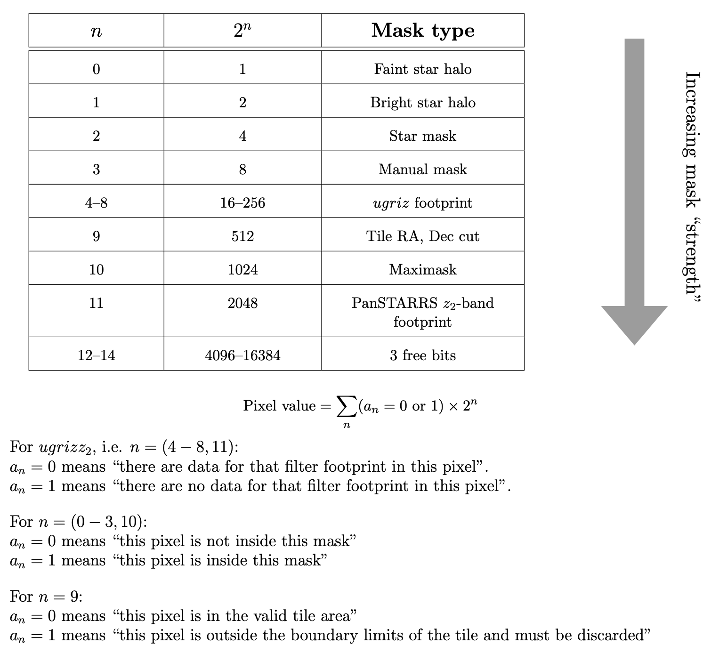

# reg2fits mask processing bundle

This directory contains the standalone scripts and config needed to build the 5 intermediate UNIONS mask FITS products and the final combined mask.

## Contents

- `cutreg4tile.py`
  - builds the per-tile external polygon region file from the master `large_galaxy.reg`
- `reg2fits.py`
  - converts DS9 polygon region files into gzip-compressed FITS mask images
- `trim_edges_mask.py`
  - builds the gzip-compressed trim-edge mask directly from `FullSky_tiles_cuts.txt`
- `compute_tile_radec_cuts.py`
  - computes `RAmin`, `RAmax`, `DECmin`, `DECmax` from a tile ID using the wrapped tile-cut convention
- `combine_masks.py`
  - combines the 5 mask layers into the final gzip-compressed mask
- `finalmask_to_binary.py`
  - extracts a binary 0/1 FITS mask from the final 16-bit combined mask using any chosen bit selection
- `maximask/make_unions_maximask.py`
  - runs the maximask pipeline and writes the final gzip-compressed UNIONS maximask
- `maximask/maximask_config/`
  - maximask config files used by `make_unions_maximask.py`
- `data/large_galaxy.reg`
  - master external polygon catalogue
- `data/FullSky_tiles_cuts.txt`
  - tile boundary catalogue used for trim masks
- `tile_lists/sample_tiles.txt`
  - minimal example tile list

## Python dependencies

Install:

```bash
python3 -m pip install -r requirements.txt
```

Required packages:

- `numpy`
- `astropy`
- `Pillow`
- `scipy`

External dependency for maximask:

- `/opt/conda/bin/maximask`

This bundle includes the maximask config files, but not the maximask binary itself.

## Tile selection

All scripts support either:

- one tile with `--tile 122.316`
- many tiles with `--tile-list-file DR6_tiles.list`

The tile list file must contain one tile ID per line.

## Bit definition

The final combined mask is a bit-coded image. The figure below summarizes the current bit assignments and pixel-value convention.



## The 5 intermediate masks

### 1. Star mask

Input:

- `UNIONS.{tile}_r_maskstars.reg`

Output:

- `UNIONS.{tile}_r_maskstars.mask.fits.gz`

Single tile:

```bash
python3 reg2fits.py \
  --tile 122.316 \
  --input-template '/arc/projects/unions/catalogues/unions/GAaP_photometry/UNIONS_DR6/UNIONS.{tile}/r/UNIONS.{tile}_r_maskstars.reg' \
  --cleaned-template '/arc/projects/unions/catalogues/unions/GAaP_photometry/UNIONS_DR6_stars/UNIONS.{tile}_r_maskstars.fixed.reg' \
  --output-template '/arc/projects/unions/catalogues/unions/GAaP_photometry/UNIONS_DR6_stars/UNIONS.{tile}_r_maskstars.mask.fits.gz' \
  --source-templates '/arc/projects/unions/catalogues/unions/GAaP_photometry/UNIONS_DR6/UNIONS.{tile}/r/UNIONS.{tile}_r.fits'
```

Tile list:

```bash
python3 reg2fits.py \
  --tile-list-file DR6_tiles.list \
  --input-template '/arc/projects/unions/catalogues/unions/GAaP_photometry/UNIONS_DR6/UNIONS.{tile}/r/UNIONS.{tile}_r_maskstars.reg' \
  --cleaned-template '/arc/projects/unions/catalogues/unions/GAaP_photometry/UNIONS_DR6_stars/UNIONS.{tile}_r_maskstars.fixed.reg' \
  --output-template '/arc/projects/unions/catalogues/unions/GAaP_photometry/UNIONS_DR6_stars/UNIONS.{tile}_r_maskstars.mask.fits.gz' \
  --source-templates '/arc/projects/unions/catalogues/unions/GAaP_photometry/UNIONS_DR6/UNIONS.{tile}/r/UNIONS.{tile}_r.fits'
```

### 2. External polygon mask

This is built in 2 steps.

Step A: extract the tile-local region file from `data/large_galaxy.reg`.

Output:

- `UNIONS.{tile}.ext_polygon.reg`

Single tile:

```bash
python3 cutreg4tile.py \
  --tiles 122.316 \
  --master-reg data/large_galaxy.reg \
  --fits-template '/arc/projects/unions/catalogues/unions/GAaP_photometry/UNIONS_DR6/UNIONS.{tile}/r/UNIONS.{tile}_r.fits' \
  --output-template '/arc/projects/unions/catalogues/unions/GAaP_photometry/ext_polygon_UNIONS/UNIONS.{tile}.ext_polygon.reg'
```

Tile list:

```bash
python3 cutreg4tile.py \
  --tile-list-file DR6_tiles.list \
  --master-reg data/large_galaxy.reg \
  --fits-template '/arc/projects/unions/catalogues/unions/GAaP_photometry/UNIONS_DR6/UNIONS.{tile}/r/UNIONS.{tile}_r.fits' \
  --output-template '/arc/projects/unions/catalogues/unions/GAaP_photometry/ext_polygon_UNIONS/UNIONS.{tile}.ext_polygon.reg'
```

Step B: convert the tile-local region file into FITS.

Output:

- `UNIONS.{tile}.ext_polygon.mask.fits.gz`

Single tile:

```bash
python3 reg2fits.py \
  --tile 122.316 \
  --input-template '/arc/projects/unions/catalogues/unions/GAaP_photometry/ext_polygon_UNIONS/UNIONS.{tile}.ext_polygon.reg' \
  --cleaned-template '/arc/projects/unions/catalogues/unions/GAaP_photometry/ext_polygon_UNIONS/UNIONS.{tile}.ext_polygon.fixed.reg' \
  --output-template '/arc/projects/unions/catalogues/unions/GAaP_photometry/ext_polygon_UNIONS/UNIONS.{tile}.ext_polygon.mask.fits.gz' \
  --source-templates '/arc/projects/unions/catalogues/unions/GAaP_photometry/UNIONS_DR6/UNIONS.{tile}/r/UNIONS.{tile}_r.fits'
```

Tile list:

```bash
python3 reg2fits.py \
  --tile-list-file DR6_tiles.list \
  --input-template '/arc/projects/unions/catalogues/unions/GAaP_photometry/ext_polygon_UNIONS/UNIONS.{tile}.ext_polygon.reg' \
  --cleaned-template '/arc/projects/unions/catalogues/unions/GAaP_photometry/ext_polygon_UNIONS/UNIONS.{tile}.ext_polygon.fixed.reg' \
  --output-template '/arc/projects/unions/catalogues/unions/GAaP_photometry/ext_polygon_UNIONS/UNIONS.{tile}.ext_polygon.mask.fits.gz' \
  --source-templates '/arc/projects/unions/catalogues/unions/GAaP_photometry/UNIONS_DR6/UNIONS.{tile}/r/UNIONS.{tile}_r.fits'
```

### 3. Ugriz mask

This file already exists natively:

```text
/arc/projects/unions/catalogues/unions/GAaP_photometry/UNIONS_DR6/UNIONS.{tile}/UNIONS.{tile}_ugriz.mask.fits.gz
```

There is no construction step from these scripts.

### 4. Trim-edge mask

Input:

- `data/FullSky_tiles_cuts.txt`
- tile WCS from `UNIONS.{tile}_r.fits`

Output:

- `UNIONS.{tile}_r_masktrim.fits.gz`

Single tile:

```bash
python3 trim_edges_mask.py \
  --tile 122.316 \
  --tile-cuts data/FullSky_tiles_cuts.txt \
  --source-templates '/arc/projects/unions/catalogues/unions/GAaP_photometry/UNIONS_DR6/UNIONS.{tile}/r/UNIONS.{tile}_r.fits' \
  --output-template '/arc/projects/unions/catalogues/unions/GAaP_photometry/UNIONS_DR6_edges/UNIONS.{tile}_r_masktrim.fits.gz'
```

Tile list:

```bash
python3 trim_edges_mask.py \
  --tile-list-file DR6_tiles.list \
  --tile-cuts data/FullSky_tiles_cuts.txt \
  --source-templates '/arc/projects/unions/catalogues/unions/GAaP_photometry/UNIONS_DR6/UNIONS.{tile}/r/UNIONS.{tile}_r.fits' \
  --output-template '/arc/projects/unions/catalogues/unions/GAaP_photometry/UNIONS_DR6_edges/UNIONS.{tile}_r_masktrim.fits.gz'
```

If a tile is missing from `FullSky_tiles_cuts.txt`, you can generate the cut values analytically with:

```bash
python3 compute_tile_radec_cuts.py --tile 000.046
```

or for a whole list:

```bash
python3 compute_tile_radec_cuts.py \
  --tile-list-file tiles_with_no_RADECcuts.list \
  --output tiles_with_no_RADECcuts.computed.txt
```

This script applies the wrapped-cut convention used near the RA=0/360 boundary.

### 5. Maximask

Input:

- `UNIONS.{tile}_r.fits`

Output:

- `UNIONS.{tile}.r.maximask.fits.gz`

Single tile:

```bash
python3 maximask/make_unions_maximask.py \
  --tile 122.316 \
  --input-template '/arc/projects/unions/catalogues/unions/GAaP_photometry/UNIONS_DR6/UNIONS.{tile}/r/UNIONS.{tile}_r.fits' \
  --output-template '/arc/projects/unions/catalogues/unions/GAaP_photometry/UNIONS_DR6_maximask/UNIONS.{tile}.r.maximask.fits.gz'
```

Tile list:

```bash
python3 maximask/make_unions_maximask.py \
  --tile-list-file DR6_tiles.list \
  --input-template '/arc/projects/unions/catalogues/unions/GAaP_photometry/UNIONS_DR6/UNIONS.{tile}/r/UNIONS.{tile}_r.fits' \
  --output-template '/arc/projects/unions/catalogues/unions/GAaP_photometry/UNIONS_DR6_maximask/UNIONS.{tile}.r.maximask.fits.gz'
```

Parallel tile-list production:

```bash
python3 maximask/make_unions_maximask.py \
  --tile-list-file DR6_tiles.list \
  --input-template '/arc/projects/unions/catalogues/unions/GAaP_photometry/UNIONS_DR6/UNIONS.{tile}/r/UNIONS.{tile}_r.fits' \
  --output-template '/arc/projects/unions/catalogues/unions/GAaP_photometry/UNIONS_DR6_maximask/UNIONS.{tile}.r.maximask.fits.gz' \
  --jobs 16
```

## Final combined mask

This combines:

- `UNIONS.{tile}_r_maskstars.mask.fits.gz`
- `UNIONS.{tile}.ext_polygon.mask.fits.gz`
- `UNIONS.{tile}_ugriz.mask.fits.gz`
- `UNIONS.{tile}_r_masktrim.fits.gz`
- `UNIONS.{tile}.r.maximask.fits.gz`

Output:

- `UNIONS.{tile}_final.mask.fits.gz`

Single tile:

```bash
python3 combine_masks.py \
  --tile 122.316 \
  --maskstars-template '/arc/projects/unions/catalogues/unions/GAaP_photometry/UNIONS_DR6_stars/UNIONS.{tile}_r_maskstars.mask.fits.gz' \
  --extpoly-template '/arc/projects/unions/catalogues/unions/GAaP_photometry/ext_polygon_UNIONS/UNIONS.{tile}.ext_polygon.mask.fits.gz' \
  --ugriz-template '/arc/projects/unions/catalogues/unions/GAaP_photometry/UNIONS_DR6/UNIONS.{tile}/UNIONS.{tile}_ugriz.mask.fits.gz' \
  --trim-template '/arc/projects/unions/catalogues/unions/GAaP_photometry/UNIONS_DR6_edges/UNIONS.{tile}_r_masktrim.fits.gz' \
  --maximask-template '/arc/projects/unions/catalogues/unions/GAaP_photometry/UNIONS_DR6_maximask/UNIONS.{tile}.r.maximask.fits.gz' \
  --output-dir '/arc/projects/unions/catalogues/unions/GAaP_photometry/UNIONS_DR6_finalmask'
```

Tile list:

```bash
python3 combine_masks.py \
  --tile-list-file DR6_tiles.list \
  --maskstars-template '/arc/projects/unions/catalogues/unions/GAaP_photometry/UNIONS_DR6_stars/UNIONS.{tile}_r_maskstars.mask.fits.gz' \
  --extpoly-template '/arc/projects/unions/catalogues/unions/GAaP_photometry/ext_polygon_UNIONS/UNIONS.{tile}.ext_polygon.mask.fits.gz' \
  --ugriz-template '/arc/projects/unions/catalogues/unions/GAaP_photometry/UNIONS_DR6/UNIONS.{tile}/UNIONS.{tile}_ugriz.mask.fits.gz' \
  --trim-template '/arc/projects/unions/catalogues/unions/GAaP_photometry/UNIONS_DR6_edges/UNIONS.{tile}_r_masktrim.fits.gz' \
  --maximask-template '/arc/projects/unions/catalogues/unions/GAaP_photometry/UNIONS_DR6_maximask/UNIONS.{tile}.r.maximask.fits.gz' \
  --output-dir '/arc/projects/unions/catalogues/unions/GAaP_photometry/UNIONS_DR6_finalmask'
```

Parallel tile-list production:

```bash
python3 combine_masks.py \
  --tile-list-file DR6_tiles.list \
  --maskstars-template '/arc/projects/unions/catalogues/unions/GAaP_photometry/UNIONS_DR6_stars/UNIONS.{tile}_r_maskstars.mask.fits.gz' \
  --extpoly-template '/arc/projects/unions/catalogues/unions/GAaP_photometry/ext_polygon_UNIONS/UNIONS.{tile}.ext_polygon.mask.fits.gz' \
  --ugriz-template '/arc/projects/unions/catalogues/unions/GAaP_photometry/UNIONS_DR6/UNIONS.{tile}/UNIONS.{tile}_ugriz.mask.fits.gz' \
  --trim-template '/arc/projects/unions/catalogues/unions/GAaP_photometry/UNIONS_DR6_edges/UNIONS.{tile}_r_masktrim.fits.gz' \
  --maximask-template '/arc/projects/unions/catalogues/unions/GAaP_photometry/UNIONS_DR6_maximask/UNIONS.{tile}.r.maximask.fits.gz' \
  --output-dir '/arc/projects/unions/catalogues/unions/GAaP_photometry/UNIONS_DR6_finalmask' \
  --problem-log combine_masks_problems.log \
  --jobs 16
```

## Binary extraction from the final mask

`finalmask_to_binary.py` reads `UNIONS.{tile}_final.mask.fits.gz` and writes a binary FITS image containing only `0` and `1`, by activating whichever final-mask bits you select.

To print all accepted `--masks` keywords directly from the command line:

```bash
python3 finalmask_to_binary.py --list-masks
```

Bit assignments used by the current final mask:

- `0`: faint star halo
- `1`: bright star halo
- `2`: star mask
- `3`: manual mask / external polygon
- `4`: `u` footprint
- `5`: `g` footprint
- `6`: `r` footprint
- `7`: `i` footprint
- `8`: `z` footprint
- `9`: tile RA/DEC trim
- `10`: maximask
- `11`: PanSTARRS `z2` footprint
- `12-14`: free bits

The main selection syntax is simply:

- `--select trim`
- `--select manual_mask trim maximask`
- `--select 3 9 10`

Each selected keyword or bit number is activated in the output binary mask. Any bit that is not selected is ignored.

Single tile:

```bash
python3 finalmask_to_binary.py \
  --tile 122.316 \
  --input-template '/arc/projects/unions/catalogues/unions/GAaP_photometry/UNIONS_DR6_finalmask/UNIONS.{tile}_final.mask.fits.gz' \
  --output-template '/arc/projects/unions/catalogues/unions/GAaP_photometry/UNIONS_DR6_binary_masks/UNIONS.{tile}_science.binary.fits.gz' \
  --select manual_mask trim maximask
```

The example above writes `1` wherever any of these selected mask bits is present in the final mask:

- manual mask
- trim mask
- maximask

Tile list:

```bash
python3 finalmask_to_binary.py \
  --tile-list-file DR6_tiles.list \
  --input-template '/arc/projects/unions/catalogues/unions/GAaP_photometry/UNIONS_DR6_finalmask/UNIONS.{tile}_final.mask.fits.gz' \
  --output-template '/arc/projects/unions/catalogues/unions/GAaP_photometry/UNIONS_DR6_binary_masks/UNIONS.{tile}_science.binary.fits.gz' \
  --select manual_mask trim maximask \
  --jobs 16
```

Another example, recovering exactly the trim-mask footprint in binary form:

```bash
python3 finalmask_to_binary.py \
  --tile 122.316 \
  --input-template '/arc/projects/unions/catalogues/unions/GAaP_photometry/UNIONS_DR6_finalmask/UNIONS.{tile}_final.mask.fits.gz' \
  --output-template '/arc/projects/unions/catalogues/unions/GAaP_photometry/UNIONS_DR6_binary_masks/UNIONS.{tile}_trim.binary.fits.gz' \
  --select trim
```

## Notes

- `reg2fits.py`, `trim_edges_mask.py`, `combine_masks.py`, `finalmask_to_binary.py`, and `maximask/make_unions_maximask.py` all support `--tile-list-file`.
- `cutreg4tile.py` supports either `--tiles ...` or `--tile-list-file`.
- `combine_masks.py` and `maximask/make_unions_maximask.py` support problem logs and continue past failed tiles.
- `trim_edges_mask.py` writes a skipped-tile log for tile IDs missing from `FullSky_tiles_cuts.txt`.
- `reg2fits.py` supports tile lists, but does not currently have a built-in problem log.
- The path templates in the examples are production examples from the UNIONS layout and can be adapted if your files live elsewhere.
